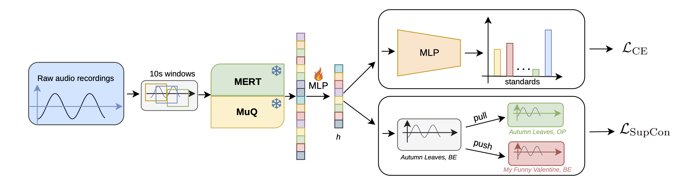
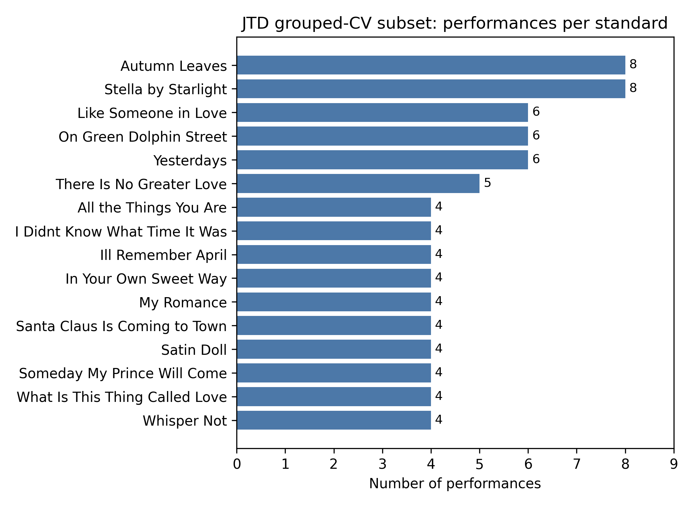

# Tip of My Ear

This repository contains the code for the paper
[Evaluating Pretrained Music Embeddings for Cross-Performance Jazz Standard Recognition](https://arxiv.org/abs/2607.00777).



## Paper Setup

In the paper, we use a curated subset of the
[Jazz Trio Database](https://github.com/HuwCheston/Jazz-Trio-Database). This subset contains:

- 16 standards 
- 79 sampled performances after keeping at most one performance per
  standard/group
- 27 unique groups
- 10 second windows with 5 second hop for the main experiments (and 20 second windows with 10 second hop for ablation)
- We report results on `fold_00` through `fold_03` in the paper, each holding out one
  performance per standard in the test setting.

Here's the distribution of training performances, from Figure 1 of the paper:


We provide metadata for the folds used in the paper, and a script to generate similar folds of the data.

## Repository Layout

```text
.
├── data/processed/jtd_group_cv_16/   # tracked classes, fold CSVs, window manifests
├── figures/                          # paper figure exports
├── scripts/                          # command-line experiment entrypoints
├── shell_scripts/                    # fold runners used for paper experiments
├── src/tipofmyear/                   # package code
├── tests/                            # unit tests for release-critical behavior
├── jtd.csv                           # metadata source
├── pyproject.toml
└── README.md
```

Please note that as JTD is a request-only dataset and the training audio files are copyright-protected
we are not able to provide processed audio, embeddings from such audio, or model checkpoints trained on these files.
However, the models and pipelines are fairly light-weight and you should be able to easily train them
if you have the JTD dataset.

## Installation

Create an environment and install the package with

```bash
python3 -m venv .venv
source .venv/bin/activate
python -m pip install -e ".[all]"
```
for easiest environment setup.

Alternatively, for a minimal installation you can use:

```
python -m pip install -e ".[all]"
```

In the project we use embeddings from MERT and MuQ models, and you can optionally install the requirements with:

```bash
python -m pip install -e ".[mert]"
python -m pip install -e ".[muq]"
python -m pip install -e ".[tracking]"
```

## Quick-start

If your environment has JTD configured through `mirdata`, use it to locate or
download the dataset according to the JTD access terms:

```python
import mirdata

jtd = mirdata.initialize("jtd")
jtd.download()
```

# Data Preparation

We provide the validation setup and folds within `data/processed/jtd_group_cv_16` for reproducibility,
so you can skip this part.

However, if you change the subsets, you can regenerate them with:

```bash
python scripts/prepare_grouped_cv.py \
  --metadata-csv jtd.csv \
  --output-dir data/processed/jtd_group_cv_16 \
  --min-groups 4 \
  --seed 1337
```

Note that with 4 performances for model only folds `00 01 02 03` have balanced validation and test sets,
so we train and evaluate models on these folds.

### Audio conversion

JTD contains raw audio files in `.wav` format, and we need to convert them.

To convert the selected recordings to local 24 kHz mono audio, use:

```bash
python scripts/prepare_audio_24k.py \
  --selected-performances data/processed/jtd_group_cv_16/selected_performances.csv \
  --raw-audio-root /path/to/local/jtd/wavs \
  --output-dir data/processed/jtd_group_cv_16/audio_24k_mono \
  --output-manifest data/processed/jtd_group_cv_16/manifests/performances_24k.csv
```

where `/path/to/local/jtd/wavs` points towards a directory with the `.wav` files that come with the JTD dataset.

With this setup, the script generates converted files under `data/processed/jtd_group_cv_16/audio_24k_mono/`.

### Window preparation

Similar to data preparation we provide the 10second/5s hop window CSVs beforehand,
so you can skip this part again.

However, if you need to rebuild them, use:

```bash
python scripts/make_window_manifest.py \
  --performance-manifest data/processed/jtd_group_cv_16/manifests/performances_24k.csv \
  --folds-dir data/processed/jtd_group_cv_16/folds \
  --output-dir data/processed/jtd_group_cv_16/manifests \
  --window-sec 10 \
  --hop-sec 5
```

We also precompute the 20s window / 10s hop ablation window CSVs and provide them in the same location.

## Example commands

We provide scripts for from-scratch training of HCNNs and probing/retrieval based on embeddings. 
For convenience, we provide scripts in `shell_scripts/` for easier training and evaluation of these models.
---

You can also run them with a bit more detail:

For from-scratch training, train the Harmonic CNN baseline for fold `00` with:

```bash
python scripts/train_hcnn.py \
  --fold-dir data/processed/jtd_group_cv_16/manifests/fold_00 \
  --classes-json data/processed/jtd_group_cv_16/classes.json \
  --results-dir results/hcnn/fold_00 \
  --epochs 20 \
  --batch-size 16 \
  --no-wandb
```

For embedding-based probing and retrieval, 
we use the open-source [MERT-v1-95M](https://huggingface.co/m-a-p/MERT-v1-95M) 
and [MuQ](https://huggingface.co/OpenMuQ/MuQ-large-msd-iter) models.

You can extract frozen MERT embeddings with:

```bash
python scripts/extract_mert.py \
  --manifest data/processed/jtd_group_cv_16/manifests/windows_10s_hop5s.csv \
  --output data/processed/jtd_group_cv_16/features/mert_10s/mert_v1_95m_layermean_concat.pt \
  --model-id m-a-p/MERT-v1-95M \
  --batch-size 4 \
  --device auto
```

Similarly, extract frozen MuQ embeddings:

```bash
python scripts/extract_muq.py \
  --manifest data/processed/jtd_group_cv_16/manifests/windows_10s_hop5s.csv \
  --output data/processed/jtd_group_cv_16/features/muq_10s/muq_large_msd_iter_layermean_concat.pt \
  --model-id OpenMuQ/MuQ-large-msd-iter \
  --batch-size 4
```

Train a linear or MLP probe over cached embeddings:

```bash
python scripts/train_linear_probe.py \
  --feature-cache data/processed/jtd_group_cv_16/features/mert_10s/mert_v1_95m_layermean_concat.pt \
  --fold-dir data/processed/jtd_group_cv_16/manifests/fold_00 \
  --classes-json data/processed/jtd_group_cv_16/classes.json \
  --results-dir results/mert_linear/fold_00 \
  --epochs 100 \
  --batch-size 64 \
  --learning-rate 1e-3 \
  --head linear # or mlp
```

For retrieval: evaluate kNN retrieval over cached embeddings with

```bash
python scripts/eval_knn_probe.py \
  --feature-cache data/processed/jtd_group_cv_16/features/mert_10s/mert_v1_95m_layermean_concat.pt \
  --fold-dir data/processed/jtd_group_cv_16/manifests/fold_00 \
  --classes-json data/processed/jtd_group_cv_16/classes.json \
  --results-dir results/mert_knn/fold_00 \
  --k 5 \
  --metric cosine \
  --weights distance
```

For retrieval with supervised contrastive training, you can train the supervised contrastive projection used for the retrieval ablation on fold `00` with:

```bash
python scripts/train_supcon_projection.py \
  --feature-cache data/processed/jtd_group_cv_16/features/muq_10s/muq_large_msd_iter_layermean_concat.pt \
  --fold-dir data/processed/jtd_group_cv_16/manifests/fold_00 \
  --classes-json data/processed/jtd_group_cv_16/classes.json \
  --results-dir results/muq_supcon_ce_knn_10s/fold_00 \
  --projection-dim 256 \
  --lambda-supcon 0.2 \
  --epochs 100 \
  --k 5
```

We report results over all folds by summarize fold metrics with:

```bash
python scripts/summarize_results.py \
  --results-root results/mert_linear \
  --folds fold_00 fold_01 fold_02 fold_03 \
  --output results/mert_linear/summary.json \
  --markdown-output results/mert_linear/summary.md
```

Analyze same-group nearest-neighbor overlap for MERT with 10s windows:

```bash
python scripts/analyze_knn_group_overlap.py \
    --result-dir results/final_mert_knn_10s_k5/fold_${fold} \
    --query-split test \
    --use-existing-neighbors \
    --k 5 \
    --output-dir results/final_mert_knn_10s_k5/fold_${fold}/group_overlap_test
```
This small script reports for the "Same Group Frequency" metric as `same_group_neighbor_rate_at_k`.

## Results

Main 10 second results, from Table 1 of the paper:

| Method | Window Acc. | Perf. Top-1 | Perf. Top-5 |
| --- | ---: | ---: | ---: |
| Harmonic CNN | 0.034 +/- 0.012 | 0.031 +/- 0.036 | 0.359 +/- 0.079 |
| MERT linear probe | 0.074 +/- 0.056 | 0.094 +/- 0.081 | 0.359 +/- 0.139 |
| MERT MLP probe | 0.096 +/- 0.078 | 0.094 +/- 0.081 | 0.422 +/- 0.164 |
| MERT kNN, k=5 | 0.066 +/- 0.065 | 0.063 +/- 0.051 | 0.359 +/- 0.180 |
| MuQ linear probe | 0.085 +/- 0.030 | 0.078 +/- 0.031 | 0.469 +/- 0.149 |
| MuQ MLP probe | 0.108 +/- 0.068 | 0.078 +/- 0.060 | 0.438 +/- 0.102 |
| MuQ kNN, k=5 | 0.060 +/- 0.058 | 0.078 +/- 0.079 | 0.359 +/- 0.107 |

Supervised contrastive retrieval ablation:

| Method | Same Group Freq. | Window Acc. | Perf. Top-1 | Perf. Top-5 |
| --- | ---: | ---: | ---: | ---: |
| MERT kNN, k=5 | 0.336 | 0.066 +/- 0.065 | 0.063 +/- 0.051 | 0.359 +/- 0.180 |
| MERT kNN + SupCon | 0.109 | 0.081 +/- 0.078 | 0.063 +/- 0.051 | 0.469 +/- 0.120 |
| MuQ kNN, k=5 | 0.328 | 0.060 +/- 0.058 | 0.078 +/- 0.079 | 0.359 +/- 0.107 |
| MuQ kNN + SupCon | 0.160 | 0.095 +/- 0.066 | 0.109 +/- 0.060 | 0.438 +/- 0.072 |


## Citation

```bibtex
@misc{eser2026evaluating,
  title = {Evaluating Pretrained Music Embeddings for Cross-Performance Jazz Standard Recognition},
  author = {Eser, Cagri},
  year = {2026},
  eprint = {2607.00777},
  archivePrefix = {arXiv},
  primaryClass = {cs.SD},
  url = {https://arxiv.org/abs/2607.00777}
}
```
